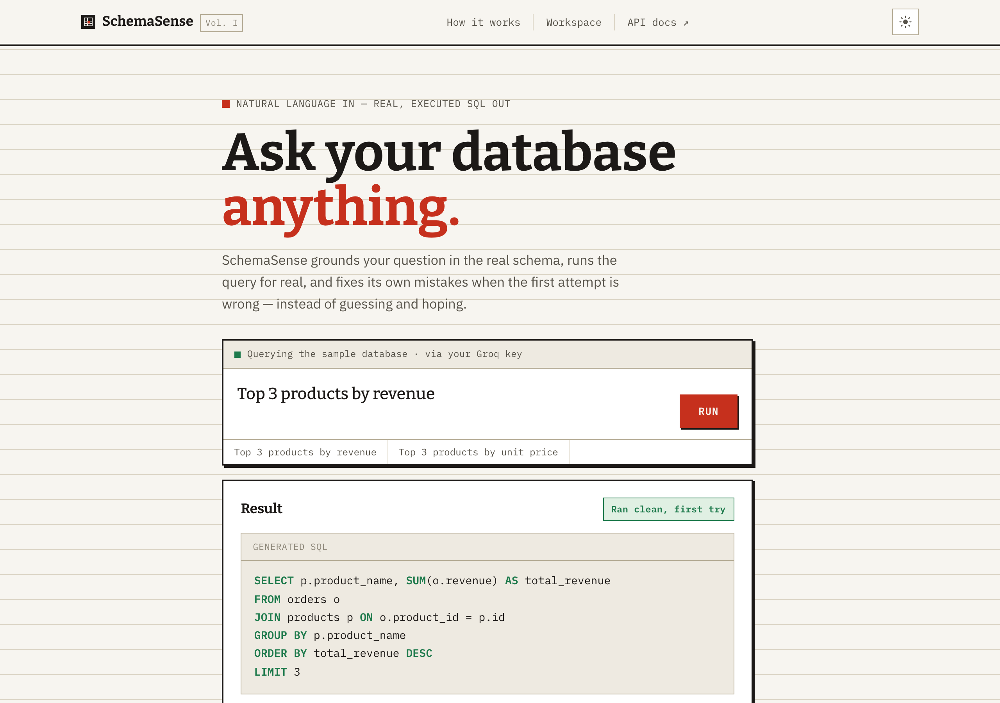
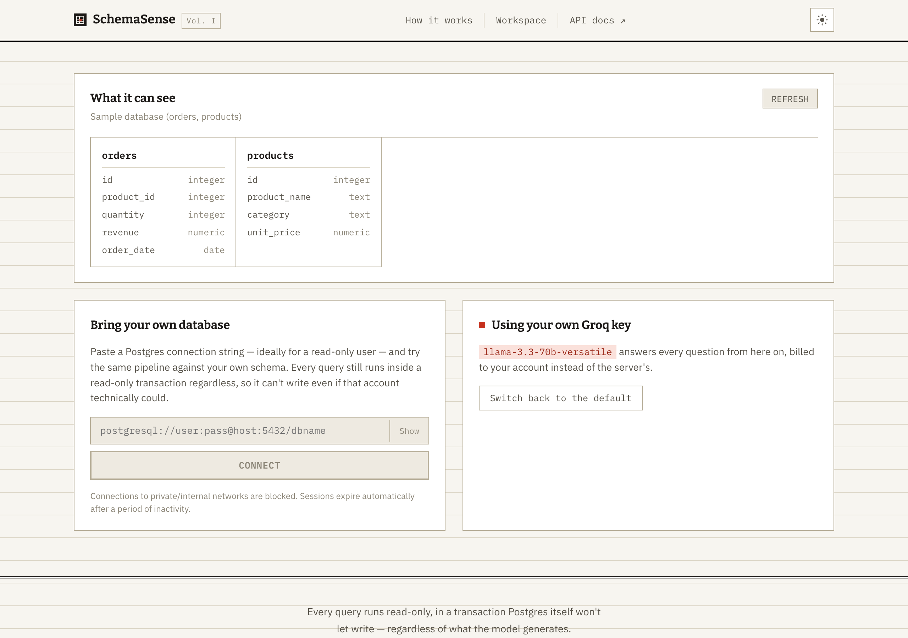

# SchemaSense

**Ask your database a question in plain English. Get back a real, executed SQL query — not a guess.**

An LLM with no context has no idea what tables or columns your database has. Asked directly, it either hallucinates plausible-sounding numbers or admits it can't help. SchemaSense closes that gap: it reads your actual schema, drafts SQL grounded in what's really there, runs it for real, and — the part most demos skip — catches its own mistakes. When a generated query fails, the exact database error goes back to the model and it tries again, up to three times, before giving up honestly instead of returning a wrong answer with confidence.



## The five things that make this real engineering, not a wrapper

- **Schema introspection** — the model only ever sees tables and columns that actually exist, read live from `information_schema`, cached in Redis.
- **Execution as grounding** — generated SQL is a hypothesis until it runs. Executing it against a real database is the equivalent of RAG's retrieval step: what turns a guess into something grounded in reality.
- **Self-correction loop** — LLM-generated SQL fails constantly (wrong column, bad join, syntax error). The system catches the *exact* database error, feeds it back to the model, and retries — capped at 3 attempts so it fails gracefully instead of looping forever.
- **Read-only safety, layered** — a generated query can never mutate data. Enforced three separate ways: a code-level check that rejects anything but `SELECT`, a Postgres `READ ONLY` transaction wrapper that Postgres itself enforces regardless of the connecting role's actual grants, and (for the seeded database) a Postgres role with `SELECT`-only privileges.
- **Ambiguity handling** — "last month," "top," "recent" get explicit date-arithmetic and sort/limit rules baked into the prompt, not left to the model to interpret consistently.

## What it can do



- **Bring your own database** — paste a Postgres connection string and the entire pipeline runs against your own schema for that session. Nothing about the connection is ever persisted to disk, Redis, or logs. Guarded against SSRF (private/internal hosts are blocked by default).
- **Bring your own LLM key** — use your own Groq or OpenAI key instead of the server's, per request. The key is never cached, logged, or reused.
- **Schema-aware quick-start questions** — the example question chips are generated from whichever database is actually connected, not a hardcoded example that stops making sense the moment you connect something else.
- **Dark mode with an actual point of view** — light mode is a paper ledger (the historical lineage of structured record-keeping); dark mode is the terminal screen that replaced it. Same system, different light source.

## Try it

- **Frontend (live):** https://frontend-pearl-nine-hu5nqtwm3d.vercel.app — the UI is fully live; it isn't wired to a public backend yet, so live queries need the backend running locally (below).
- **Locally, in under a minute:**

  ```bash
  cd backend && cp .env.example .env   # add your OPENAI_API_KEY
  docker compose up --build            # Postgres + Redis + API on :8000

  cd ../frontend && npm install && npm run dev   # UI on :5173
  ```

  Open `http://localhost:5173` and ask it something.

## Stack

Python · FastAPI · LangChain · PostgreSQL (`asyncpg`) · Redis · OpenAI / Groq · React · Vite · Docker

## How a request actually flows

```
Question → Schema introspection (cached in Redis) → Prompt assembly →
LLM drafts SQL → Safety check (SELECT-only) → Execute (read-only transaction)
  succeeds → return sql + rows + attempt count
  fails   → feed the real DB error back to the LLM → retry (≤ 3 attempts)
```

## Project layout

```
backend/    FastAPI service — see backend/README.md for the full API, safety
            model, demo mode, BYOK, rate limiting, and test suite
frontend/   React + Vite console — see frontend/README.md for the design
            system and component structure
render.yaml            Backend deployment blueprint (Render)
NL_to_SQL_Build_Guide.pdf   The original spec this was built from
```

Each side has its own detailed README — this one is the map, not the whole
territory. In particular, `backend/README.md` covers the defense-in-depth
safety model and the reasoning behind every non-obvious decision in more
depth than fits here.

## Testing

```bash
cd backend && pytest   # 48 tests, run against mocks — no live DB/Redis/LLM needed
```

Covers the self-correction loop's control flow, the read-only safety layer
(including stacked-query and CTE-smuggling attempts), the SSRF guard, demo
session lifecycle, BYOK provider routing, and the rate limiter — all
against fakes, so the suite runs in under 5 seconds with zero external
dependencies or API cost.

## Deployment

The frontend deploys to Vercel in one command (`vercel --prod` from
`frontend/`). The backend is packaged as a `render.yaml` blueprint —
Postgres + Redis + the API as a Docker service — for Render; provisioning
a fresh Postgres still needs a one-time manual step to seed it
(`backend/docker/init.sql` creates the sample data and the read-only
`nlsql_app` role, which Render's managed Postgres doesn't auto-run the
way local `docker compose` does).

## Origin

Built from a structured build guide (`NL_to_SQL_Build_Guide.pdf`) as the
second in a three-project series — the guide's own philosophy: the LLM
call is the easy 10%; the engineering is in schema introspection, the
self-correction loop, and a safety layer that doesn't just trust the
prompt.
